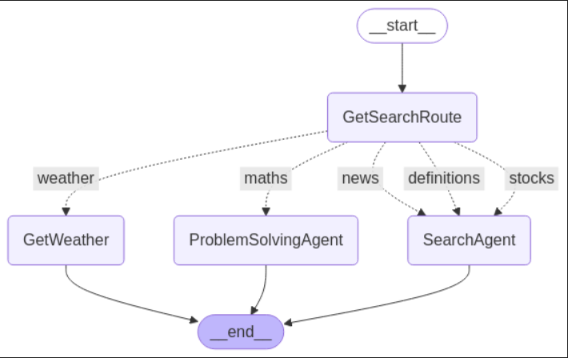

### AI-Powered Research Assistant  

#### Overview  
The **AI-Powered Research Assistant** is a Python-based application that leverages AI agents to retrieve information on various topics, including weather, mathematics, news, definitions, and stock market data. The system follows a structured decision-making flow to determine the appropriate search route based on the user's query.  

#### Project Structure  
- **`AI POWERED RESEARCH ASSISTANT.ipynb`** – Jupyter notebook for experimentation and testing.  
- **`agent_graph.py`** – Script to visualize and structure the agent decision flow.  
- **`agent_schema.py`** – Defines the agent behavior and interaction schema.  
- **`agent_tools.py`** – Contains helper functions and tools for executing searches.  
- **`app.py`** – Main application script that runs the research assistant.  
- **`bot_flow_graph.png`** – Diagram illustrating the decision-making process of the assistant.  
- **`requirements.txt`** – List of dependencies required to run the application.  

#### Flow Diagram  
  
The diagram showcases how the assistant determines the correct route based on user queries:  
- `GetSearchRoute` decides the query type.  
- Queries related to weather are handled by `GetWeather`.  
- Mathematical queries are processed by `ProblemSolvingAgent`.  
- General search queries (news, definitions, stocks) are managed by `SearchAgent`.  
- Once processed, the system reaches an `__end__` state.  

#### Installation  
1. Clone the repository:  
   ```bash
   git clone https://github.com/your-repo/ai-research-assistant.git
   cd ai-research-assistant
   ```  
2. Install dependencies:  
   ```bash
   pip install -r requirements.txt
   ```  
3. Run the application:  
   ```bash
   python app.py
   ```  

#### Usage  
- Run the script and enter queries such as:  
  - "What is the weather in Lagos?"  
  - "Solve 5x + 3 = 18"  
  - "Latest news on AI"  
- The assistant will process the query and provide results accordingly.  

#### Contributions  
Contributions are welcome! Feel free to open issues or submit pull requests to improve functionality.  

#### License  
This project is licensed under the MIT License.  
